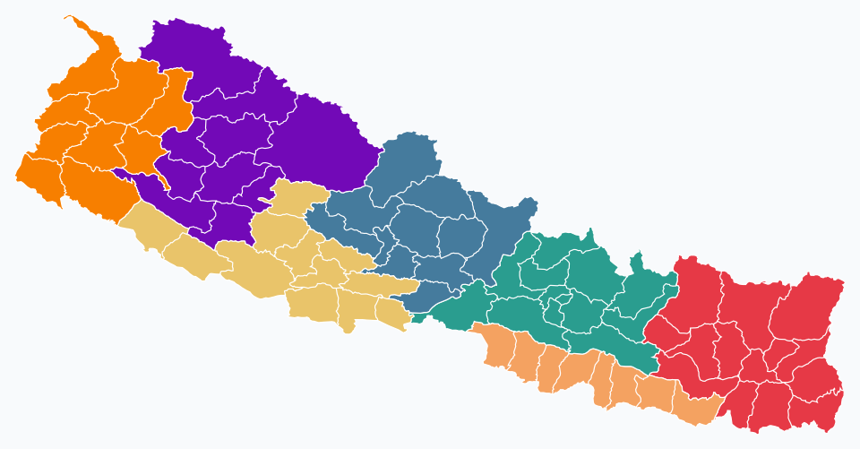
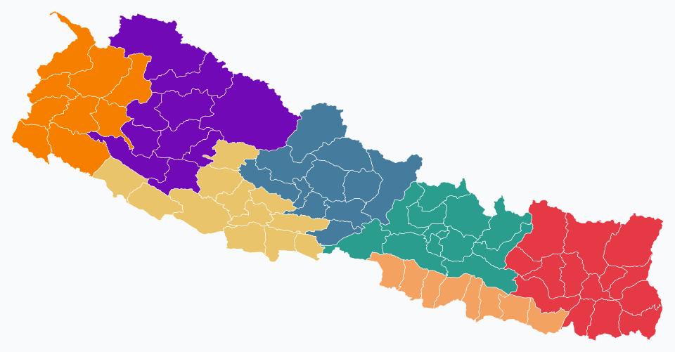
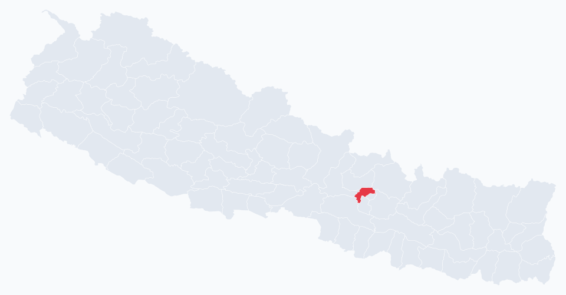
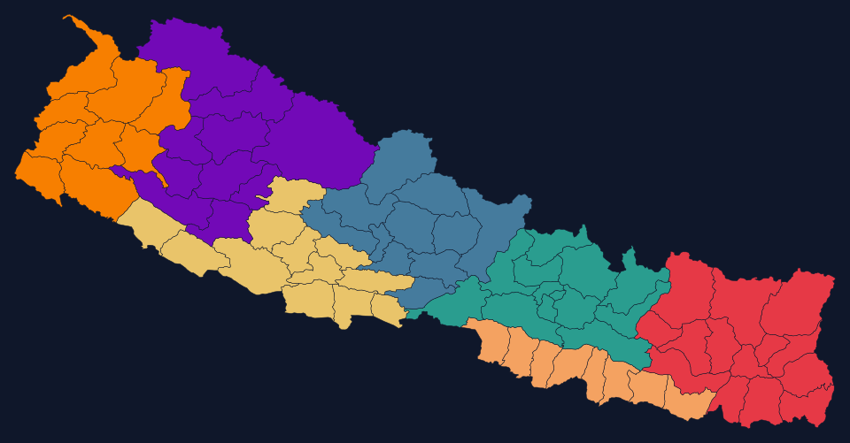
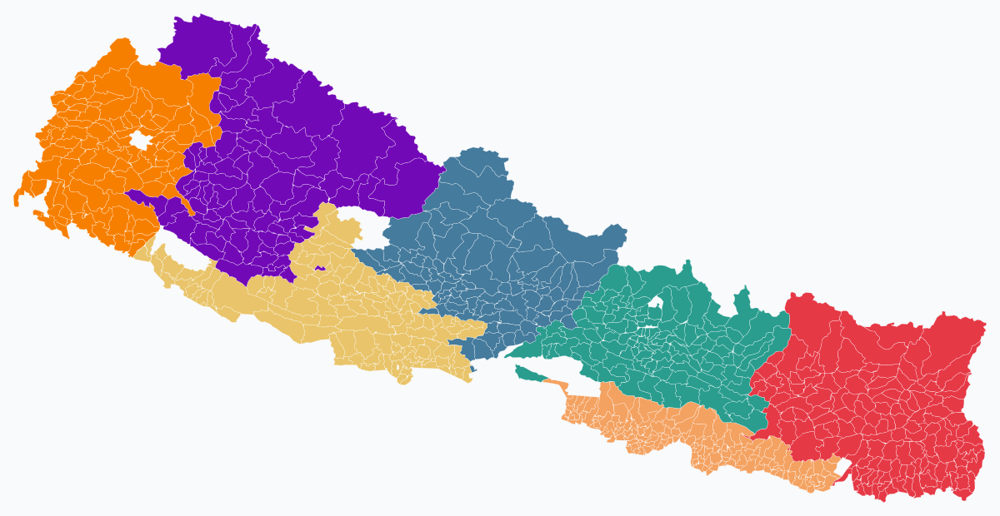
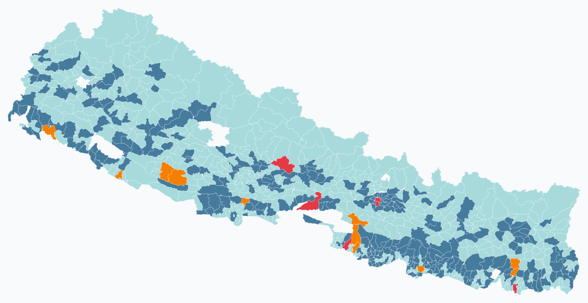

<div align="center">

# nepali-geo-pro-max

### नेपाली भूगोल — pro-max edition

The complete Nepal administrative-divisions library. **7 provinces, 77 districts, metropolitan / sub-metropolitan / municipalities / rural municipalities — with bilingual names, postal codes, capital coordinates, fuzzy search, address formatter, parser, and validator.**

[](https://www.npmjs.com/package/nepali-geo-pro-max)
[](LICENSE)


</div>

---

## 📑 Table of Contents

1. [Highlights](#-highlights)
2. [Install](#-install)
3. [Quick Start](#-quick-start)
4. [Coverage](#-coverage)
5. [Mental Model](#-mental-model)
6. [Lookups](#-lookups)
7. [Fuzzy Search](#-fuzzy-search)
8. [Address Formatting](#-address-formatting)
9. [Address Parsing](#-address-parsing)
10. [Address Validation](#-address-validation)
11. [Maps & GeoJSON](#-maps--geojson) (SVG render + point-in-polygon)
12. [Legacy Admin Layer](#-legacy-admin-layer-pre-2015--pre-2017) (5 regions, 14 zones, 75 districts — bidirectional mapping)
13. [Full API Reference](#-full-api-reference)
14. [Recipes](#-recipes)
15. [Contributing](#-contributing)

---

## ✨ Highlights

- 🇳🇵 **Bilingual everywhere** — every record has `nameEn` (Roman) + `nameNe` (Devanagari)
- 📍 **All 7 provinces + 77 districts** (post-2017 federal restructuring)
- 🏙️ **All 753 local-level units** — 6 metropolitan + 11 sub-metropolitan + 276 municipalities + 460 rural municipalities, with bilingual names and ward counts
- 🏛️ **Legacy admin layer** — 5 development regions, 14 zones, **75 pre-2017 districts** with bidirectional cross-walks to the modern federal hierarchy (for migrating archived datasets)
- 🔍 **Fuzzy search** — Levenshtein-based, bilingual queries, alias-aware (`KMC` → KMC, `Patan` → Lalitpur)
- 📮 **Postal-code lookup** — find a city by 5-digit code
- 📝 **Address formatter** — short / long / postal styles, English or Nepali output
- 📥 **Address parser** — free-form input → structured parts with confidence score
- ✅ **Address validator** — checks province/district/local-unit/ward consistency
- 🆔 **Stable canonical IDs** — `P3.D05.L01.W05` (modern) and `R2 / Z05 / LD23` (legacy)
- 🗺️ **Maps included** — official **चुच्चे (chuche) map** of Nepal (post-May-2020 boundary including Kalapani / Lipulekh / Limpiyadhura), bundled GeoJSON for 7 provinces + 77 districts + **all 753 palikas**, `toSvg()` for static/SSR + `toSvgPaths()` for interactive React/Vue/Svelte, plus `(lat, lng) → district / palika` point-in-polygon — works in Node, the browser, and edge runtimes
- 📦 **Tree-shakeable** — pure ESM exports, `sideEffects: false`
- 🎯 **TypeScript-first** — strict mode, branded types, full JSDoc
- 🪶 **Zero dependencies** — Node, Deno, Bun, browsers, Workers

---

## 📦 Install

```bash
npm install nepali-geo-pro-max
pnpm add nepali-geo-pro-max
yarn add nepali-geo-pro-max
bun add nepali-geo-pro-max
```

Works with **Node ≥ 14**, modern browsers, Deno, Bun, Cloudflare Workers, Vercel Edge.

---

## ⚡ Quick Start

```ts
import {
  PROVINCES,
  getProvinces,
  getDistrictsByProvince,
  getLocalUnit,
  search,
  formatAddress,
  parseAddress,
  validateAddress,
} from "nepali-geo-pro-max";

// All 7 provinces
PROVINCES.length;                                    // 7

// Districts of Bagmati
getDistrictsByProvince("Bagmati").map((d) => d.nameEn);
// ["Bhaktapur", "Chitwan", "Dhading", ..., "Sindhupalchok"]

// Lookup by alias
getLocalUnit("KMC")?.nameEn;
// "Kathmandu Metropolitan City"

// Fuzzy + bilingual search
search("ललितपुर")[0]?.record.nameEn;                  // "Lalitpur"
search("Lalipur")[0]?.score;                          // ≈ 0.87  (typo tolerated)

// Format an address
formatAddress({
  province: "Bagmati",
  district: "Kathmandu",
  localUnit: "Kathmandu Metropolitan City",
  ward: 5,
});
// "Ward 5, Kathmandu Metropolitan City, Kathmandu, Bagmati Province"

// Same address in Nepali
formatAddress(parts, { locale: "ne" });
// "वडा ५, काठमाडौँ महानगरपालिका, काठमाडौँ, बागमती"

// Parse free-form input
parseAddress("Ward 5, KMC, Kathmandu, Bagmati").parts;
// { ward: 5, localUnit: "P3.D05.L01", district: "P3.D05", province: "P3" }

// Validate
validateAddress({ province: "Bagmati", district: "Kaski" }).errors;
// [{ field: "district", code: "mismatch", message: "..." }]
```

---

## 📊 Coverage

### Current (post-2015 / 2017 federal)

| Level | v1.0 | Total in Nepal | Notes |
|---|---|---|---|
| Provinces | **7 / 7** ✅ | 7 | Full bilingual + capital + area + population |
| Districts | **77 / 77** ✅ | 77 | Full bilingual + headquarters + aliases |
| Metropolitan cities | **6 / 6** ✅ | 6 | Postal codes + coordinates + bilingual |
| Sub-metropolitan cities | **11 / 11** ✅ | 11 | Postal codes + coordinates + bilingual |
| Municipalities | **276 / 276** ✅ | 276 | Bilingual + ward counts |
| Rural municipalities | **460 / 460** ✅ | 460 | Bilingual + ward counts |
| **All local-level units** | **753 / 753** ✅ | 753 | Full 6+11+276+460 ✓ |
| Postal codes (palika) | **409 / 753** (54.3%) | ~753 | All 17 metro/sub-metro + all 77 district HQs + 216 VDC-merger-derived palikas |
| District postcode prefixes | **77 / 77** ✅ | 77 | First-2-digit lookup |
| Wards (per palika) | derived ✅ | ~6,743 | Each palika carries `wards: number`; individual ward records generated on demand |

**Two postal-code systems are shipped:**

| Constant | Coverage | When to use |
|---|---|---|
| `POSTAL_CODES` | 409 / 753 (54.3%) | Mail addressing — the legacy 1991 codes that are printed on physical mail today |
| `POSTAL_CODES_2025` | 752 / 753 (99.9%) | Canonical palika lookups — federal-aligned `PDDPP` structure (province + district + palika) |

Legacy 1991 coverage maxes out at ~54% because most rural municipalities were formed in 2017 by merging former VDCs, and Nepal Post never opened a branch in many of those VDCs. We **omit rather than guess** for unverified palikas.

### Legacy admin layer (for cross-walking archived data)

| Level | Shipped | Notes |
|---|---|---|
| Development Regions | **5 / 5** ✅ | Eastern, Central, Western, Mid-Western, Far-Western |
| Zones | **14 / 14** ✅ | Mechi, Koshi, Sagarmatha, Janakpur, Bagmati, Narayani, Gandaki, Lumbini, Dhaulagiri, Rapti, Bheri, Karnali, Seti, Mahakali |
| Legacy districts | **75 / 75** ✅ | With bidirectional cross-walks (Nawalparasi → Nawalpur + Parasi; Rukum → Eastern + Western Rukum) |


---

## 🧠 Mental Model

| Rule | Why |
|---|---|
| **Hierarchy is strictly Province → District → LocalUnit → Ward.** | Matches Nepal's federal structure. |
| **Every record has bilingual names.** | Forms in Nepal often need Devanagari display + Roman storage. |
| **Lookups are name-tolerant.** | `Kavre` finds "Kavrepalanchok"; `Province 3` finds "Bagmati"; `Patan` finds "Lalitpur". |
| **IDs are stable and hierarchical.** | `P3.D05.L01.W05` survives renames. Use IDs for storage; show names to users. |
| **Search is bilingual + fuzzy.** | `search("ललितपुर")` and `search("Lalipur")` both succeed. |
| **The parser stores IDs, the formatter displays names.** | Round-trip: `formatAddress(parseAddress(s).parts)` regenerates clean text. |
| **Postal codes are 5-digit per Nepal Postal Service.** | Kathmandu = 44600, Pokhara = 33700, Lalitpur = 44700, Bharatpur = 44200. |

---

## 🔎 Lookups

```ts
// Provinces
getProvinces();                               // all 7
getProvince("Bagmati");                       // by English name
getProvince(3);                               // by number 1-7
getProvince("बागमती");                         // by Devanagari
getProvince("Province 3");                    // by alias
getProvince("P3");                            // by id

// Districts
getDistricts();                               // all 77
getDistrict("Kathmandu");
getDistrict("Kavre");                         // alias resolves to Kavrepalanchok
getDistrictsByProvince("Bagmati");            // 13 districts

// Local units (palikas)
getLocalUnits();                              // 17 (metro + sub-metro in v1)
getLocalUnit("KMC");                          // alias
getLocalUnit("काठमाडौँ महानगरपालिका");
getLocalUnitsByDistrict("Kathmandu");
getLocalUnitsByProvince("Bagmati");

// Postal codes
findByPostalCode("44600")?.nameEn;            // "Kathmandu Metropolitan City"

// Hierarchy walk
getParents("P3.D05.L01");
// { province: <Bagmati>, district: <Kathmandu>, localUnit: <KMC> }

// Iterators
for (const p of eachProvince()) console.log(p.nameEn);

// Validation predicates
isValidProvince("Bagmati");                   // true
isValidWard("KMC", 5);                        // true (KMC has 32 wards)
isValidWard("KMC", 99);                       // false
```

---

## 🔍 Fuzzy Search

```ts
search("Lalitpur");
// [
//   { level: "district", record: <Lalitpur>, score: 1 },
//   { level: "local-unit", record: <Lalitpur Metropolitan City>, score: ~0.85 },
// ]

search("ललितपुर");                              // bilingual — same hits
search("Lalipur");                            // typo → "Lalitpur" wins with score ~0.87
search("KMC");                                // alias → KMC

// Filter by level
search("Janakpur", { levels: ["local-unit"] });

// Tune fuzzy threshold
search("xyz", { threshold: 0.6, limit: 5 });
```

---

## 📝 Address Formatting

```ts
const parts = {
  province: "Bagmati",
  district: "Kathmandu",
  localUnit: "Kathmandu Metropolitan City",
  ward: 5,
  postalCode: "44600",
};

formatAddress(parts);
// "Ward 5, Kathmandu Metropolitan City, Kathmandu, Bagmati Province"

formatAddress(parts, { style: "short" });
// "Ward 5, Kathmandu, Kathmandu, Bagmati"

formatAddress(parts, { style: "postal" });
// "Ward 5, Kathmandu Metropolitan City, Kathmandu, 44600, Bagmati Province"

formatAddress(parts, { locale: "ne" });
// "वडा ५, काठमाडौँ महानगरपालिका, काठमाडौँ, बागमती"

formatAddress(
  { house: "12", tole: "Thamel", ward: 26, district: "Kathmandu", province: "Bagmati" },
);
// "12, Thamel, Ward 26, Kathmandu, Bagmati Province"
```

---

## 📥 Address Parsing

```ts
parseAddress("Ward 5, Kathmandu Metropolitan City, Kathmandu, Bagmati");
// {
//   parts: { ward: 5, localUnit: "P3.D05.L01", district: "P3.D05", province: "P3" },
//   confidence: 0.9,
//   unmatched: [],
// }

parseAddress("वडा १०, काठमाडौँ").parts.ward;       // 10  (Devanagari ward number)
parseAddress("KMC").parts.province;                  // "P3"  (parents auto-filled)
parseAddress("44600, Kathmandu").parts.postalCode;   // "44600"

// Re-format from parsed parts:
const r = parseAddress("Ward 5, KMC, Kathmandu");
formatAddress(r.parts);
// "Ward 5, Kathmandu Metropolitan City, Kathmandu, Bagmati Province"
```

---

## ✅ Address Validation

```ts
validateAddress({
  province: "Bagmati",
  district: "Kathmandu",
  localUnit: "KMC",
  ward: 5,
});
// { ok: true, errors: [], resolved: { province, district, localUnit } }

validateAddress({ province: "Bagmati", district: "Kaski" });
// { ok: false, errors: [{ field: "district", code: "mismatch",
//   message: 'District "Kaski" is not in province "Bagmati"' }], ... }

validateAddress({ localUnit: "KMC", ward: 99 });
// { ok: false, errors: [{ field: "ward", code: "unknown",
//   message: 'Ward 99 out of range — "Kathmandu Metropolitan City" has wards 1..32' }] }
```

---

## 🗺️ Maps & GeoJSON

The package ships **the official चुच्चे (chuche) map of Nepal** — the post-May-2020 boundary that includes **Kalapani, Lipulekh, and Limpiyadhura** in Darchula district (Sudurpashchim Province). Simplified district + province GeoJSON, plus a zero-dep **`toSvg()`** renderer and **point-in-polygon** lookup. Works in Node, browsers, Bun, Deno, and edge runtimes.

<p align="center">
  
</p>

### 5-line map

```ts
import { toSvg } from "nepali-geo-pro-max";
import { NEPAL_PROVINCES_GEO } from "nepali-geo-pro-max/geo/provinces";

const PROVINCE_COLORS = {
  P1: "#E63946",  // Koshi — crimson (Nepal flag)
  P2: "#F4A261",  // Madhesh — sand
  P3: "#2A9D8F",  // Bagmati — teal
  P4: "#457B9D",  // Gandaki — steel blue
  P5: "#E9C46A",  // Lumbini — saffron
  P6: "#7209B7",  // Karnali — royal purple
  P7: "#F77F00",  // Sudurpashchim — orange
};

const svg = toSvg(NEPAL_PROVINCES_GEO, {
  width: 960,
  fill: (f) => PROVINCE_COLORS[f.properties.id],
  background: "#F8FAFC",
});
fs.writeFileSync("nepal.svg", svg);
```

### Districts coloured by province

<p align="center">
  
</p>

```ts
import { toSvg } from "nepali-geo-pro-max";
import { NEPAL_DISTRICTS_GEO } from "nepali-geo-pro-max/geo/districts";

const svg = toSvg(NEPAL_DISTRICTS_GEO, {
  width: 960,
  fill: (f) => PROVINCE_COLORS[f.properties.provinceId],
  stroke: "#FFFFFF",
  strokeWidth: 0.6,
  background: "#F8FAFC",
  featureAttrs: (f) => ({
    "data-name": f.properties.nameEn,    // wire up tooltips / hover
    "data-id": f.properties.id,
  }),
});
```

### Highlight a single district

<p align="center">
  
</p>

```ts
toSvg(NEPAL_DISTRICTS_GEO, {
  fill: (f) => f.properties.id === "P3.D05" ? "#E63946" : "#E2E8F0",
  background: "#F8FAFC",
});
```

### Dark theme

<p align="center">
  
</p>

```ts
toSvg(NEPAL_DISTRICTS_GEO, {
  fill: (f) => PROVINCE_COLORS[f.properties.provinceId],
  stroke: "#0F172A",
  strokeWidth: 0.5,
  background: "#0F172A",
});
```

### All 753 palikas

<p align="center">
  
</p>

```ts
import { toSvg } from "nepali-geo-pro-max";
import { NEPAL_LOCAL_UNITS_GEO } from "nepali-geo-pro-max/geo/local-units";

const svg = toSvg(NEPAL_LOCAL_UNITS_GEO, {
  width: 1200,
  fill: (f) => PROVINCE_COLORS[f.properties.provinceId],
  stroke: "#FFFFFF",
  strokeWidth: 0.25,
  background: "#F8FAFC",
});
```

### Palikas coloured by type

<p align="center">
  
</p>

```ts
const TYPE_COLORS = {
  metropolitan: "#E63946",        // crimson — the 6 metros
  "sub-metropolitan": "#F77F00",  // orange — the 11 sub-metros
  municipality: "#457B9D",        // steel blue — 276 municipalities
  "rural-municipality": "#A8DADC",// pale teal — 460 rural municipalities
};

toSvg(NEPAL_LOCAL_UNITS_GEO, {
  width: 1200,
  fill: (f) => TYPE_COLORS[f.properties.type],
  stroke: "#FFFFFF",
  strokeWidth: 0.25,
  background: "#F8FAFC",
});
```

### Point-in-polygon at palika resolution

```ts
import { findLocalUnitFeatureByCoords } from "nepali-geo-pro-max";
import { NEPAL_LOCAL_UNITS_GEO } from "nepali-geo-pro-max/geo/local-units";

const lu = findLocalUnitFeatureByCoords(NEPAL_LOCAL_UNITS_GEO, 27.7172, 85.3240);
// → { properties: {
//     nameEn: "Kathmandu",
//     nameNe: "काठमाडौँ महानगरपालिका",
//     districtId: "P3.D05",
//     provinceId: "P3",
//     type: "metropolitan"
//   }, ... }
```

### Use in React / Vue / Svelte / Solid

The `toSvg()` helper above returns a string — perfect for SSR, static files, emails, or `dangerouslySetInnerHTML`. For **interactive** maps where you want hover, click, or per-district event handlers, use `toSvgPaths()` instead — it returns structured per-feature data your framework can render natively.

#### React

```tsx
import { toSvgPaths } from "nepali-geo-pro-max";
import { NEPAL_DISTRICTS_GEO } from "nepali-geo-pro-max/geo/districts";
import { useMemo, useState } from "react";

const PROVINCE_COLORS = {
  P1: "#E63946", P2: "#F4A261", P3: "#2A9D8F", P4: "#457B9D",
  P5: "#E9C46A", P6: "#7209B7", P7: "#F77F00",
};

export function NepalMap() {
  const [hovered, setHovered] = useState<string | null>(null);
  const { paths, viewBox } = useMemo(
    () => toSvgPaths(NEPAL_DISTRICTS_GEO, {
      width: 800,
      fill: (f) => PROVINCE_COLORS[f.properties.provinceId],
    }),
    [],
  );

  return (
    <svg viewBox={viewBox} role="img" aria-label="Map of Nepal">
      {paths.map((p) => (
        <path
          key={p.id}
          d={p.d}
          fill={hovered === p.id ? "#000" : p.fill}
          stroke="#fff"
          strokeWidth={0.5}
          onMouseEnter={() => setHovered(p.id)}
          onMouseLeave={() => setHovered(null)}
          onClick={() => alert(p.feature.properties.nameEn)}
          style={{ cursor: "pointer", transition: "fill 0.15s" }}
        />
      ))}
    </svg>
  );
}
```

#### Vue 3

```vue
<script setup lang="ts">
import { toSvgPaths } from "nepali-geo-pro-max";
import { NEPAL_DISTRICTS_GEO } from "nepali-geo-pro-max/geo/districts";
import { ref } from "vue";

const PROVINCE_COLORS = {
  P1: "#E63946", P2: "#F4A261", P3: "#2A9D8F", P4: "#457B9D",
  P5: "#E9C46A", P6: "#7209B7", P7: "#F77F00",
};

const { paths, viewBox } = toSvgPaths(NEPAL_DISTRICTS_GEO, {
  width: 800,
  fill: (f) => PROVINCE_COLORS[f.properties.provinceId],
});

const hovered = ref<string | null>(null);
</script>

<template>
  <svg :viewBox="viewBox" role="img">
    <path
      v-for="p in paths"
      :key="p.id"
      :d="p.d"
      :fill="hovered === p.id ? '#000' : p.fill"
      stroke="#fff"
      stroke-width="0.5"
      @mouseenter="hovered = p.id"
      @mouseleave="hovered = null"
      @click="$emit('select', p.feature.properties.nameEn)"
      style="cursor: pointer"
    />
  </svg>
</template>
```

#### Svelte

```svelte
<script lang="ts">
  import { toSvgPaths } from "nepali-geo-pro-max";
  import { NEPAL_DISTRICTS_GEO } from "nepali-geo-pro-max/geo/districts";

  const PROVINCE_COLORS = {
    P1: "#E63946", P2: "#F4A261", P3: "#2A9D8F", P4: "#457B9D",
    P5: "#E9C46A", P6: "#7209B7", P7: "#F77F00",
  } as const;

  const { paths, viewBox } = toSvgPaths(NEPAL_DISTRICTS_GEO, {
    width: 800,
    fill: (f) => PROVINCE_COLORS[f.properties.provinceId],
  });

  let hovered: string | null = null;
</script>

<svg {viewBox} role="img">
  {#each paths as p (p.id)}
    <path
      d={p.d}
      fill={hovered === p.id ? "#000" : p.fill}
      stroke="#fff" stroke-width="0.5"
      on:mouseenter={() => (hovered = p.id)}
      on:mouseleave={() => (hovered = null)}
      on:click={() => alert(p.feature.properties.nameEn)}
    />
  {/each}
</svg>
```

#### SSR / static / `dangerouslySetInnerHTML`

If you don't need interactivity, the simpler `toSvg()` returns a complete SVG string:

```tsx
import { toSvg } from "nepali-geo-pro-max";
import { NEPAL_PROVINCES_GEO } from "nepali-geo-pro-max/geo/provinces";

const svg = toSvg(NEPAL_PROVINCES_GEO, { width: 800 });

// React: <div dangerouslySetInnerHTML={{ __html: svg }} />
// Next.js / Astro / SvelteKit: server-render once, embed in HTML
// Node script: fs.writeFileSync("nepal.svg", svg)
```

### Point-in-polygon (`lat, lng → district / province`)

```ts
import {
  findDistrictFeatureByCoords,
  findProvinceFeatureByCoords,
} from "nepali-geo-pro-max";
import { NEPAL_DISTRICTS_GEO } from "nepali-geo-pro-max/geo/districts";
import { NEPAL_PROVINCES_GEO } from "nepali-geo-pro-max/geo/provinces";

findDistrictFeatureByCoords(NEPAL_DISTRICTS_GEO, 27.7172, 85.3240);
// → { properties: { id: "P3.D05", provinceId: "P3", nameEn: "Kathmandu" }, ... }

findProvinceFeatureByCoords(NEPAL_PROVINCES_GEO, 28.2096, 83.9856);
// → { properties: { id: "P4" }, ... }
```

Combine with the rest of the package:

```ts
import { findDistrictFeatureByCoords, getDistrict, getLocalUnitsByDistrict } from "nepali-geo-pro-max";
import { NEPAL_DISTRICTS_GEO } from "nepali-geo-pro-max/geo/districts";

const feature = findDistrictFeatureByCoords(NEPAL_DISTRICTS_GEO, lat, lng);
const district = feature && getDistrict(feature.properties.id);
const palikas = district && getLocalUnitsByDistrict(district.id);
```

### `toSvg()` options

| Option | Default | Description |
|---|---|---|
| `width` | `800` | SVG width in px |
| `height` | auto | If unset, derived from bbox aspect ratio |
| `padding` | `8` | Padding around the map |
| `fill` | `"#e0e0e0"` | colour string OR `(feature) => string` |
| `stroke` | `"#fff"` | stroke colour |
| `strokeWidth` | `0.5` | stroke width |
| `background` | `"none"` | SVG background colour (skipped when `"none"`) |
| `title` | — | Accessible `<title>` element |
| `svgAttrs` | `{}` | Extra root `<svg>` attributes |
| `featureAttrs` | — | `(f) => Record<string, string \| number>` per `<path>` |
| `idPrefix` | `"path"` | Used when a feature lacks an `id` |

### Bundle strategy

| Import | Size (ESM) | Contents |
|---|---|---|
| `nepali-geo-pro-max` | ~232 KB | Everything except heavy GeoJSON |
| `nepali-geo-pro-max/geo` | ~6 KB | Just `toSvg`, `findFeatureByCoords`, types |
| `nepali-geo-pro-max/geo/provinces` | ~141 KB | `NEPAL_PROVINCES_GEO` only (7 polygons) |
| `nepali-geo-pro-max/geo/districts` | ~151 KB | `NEPAL_DISTRICTS_GEO` only (77 polygons) |
| `nepali-geo-pro-max/geo/local-units` | ~554 KB | `NEPAL_LOCAL_UNITS_GEO` only (753 palikas, simplified at tolerance `1e-4`) |

Polygon GeoJSON loads only if you import the `/geo/*` subpaths — bundlers like Vite, esbuild, Rollup, and webpack tree-shake them out otherwise.

### About the boundary

The maps ship the official **चुच्चे (chuche) map of Nepal** — the post-May-2020 boundary that incorporates **Kalapani, Lipulekh, and Limpiyadhura** in Darchula district (Sudurpashchim Province) per Nepal's constitutional amendment. All 77 federal-restructured districts and 753 post-2017 palikas.

Verified by tests:
- Western beak (`30.45°N, 80.60°E`) is inside Darchula district ✓
- Lipulekh Pass (`30.222°N, 81.023°E`) is inside Darchula ✓
- Kalapani (`30.20°N, 80.95°E`) is inside Darchula ✓
- Province bounding box reaches `lat 30.47` (vs old map's `~29.93` for the same area) ✓

---

## 🏛️ Legacy Admin Layer (pre-2015 / pre-2017)

Nepal's federal restructuring (2015 constitution + 2017 local-level reorganization) replaced an older hierarchy that many archived datasets still use:

- **5 Development Regions** (विकास क्षेत्र) — abolished 2015
- **14 Zones** (अञ्चल) — abolished 2015
- **75 Districts** — pre-2017, before Nawalparasi & Rukum splits

The package ships this layer **only for bidirectional cross-walking** between legacy datasets and the modern federal hierarchy — it's not a complete legacy GIS layer (no VDCs, no coordinates, no headquarters). Migrate, then drop it.

```ts
import {
  getRegion, getZone, getLegacyDistrict,
  getZonesByRegion, getLegacyDistrictsByZone, getLegacyDistrictsByRegion,
  getCurrentDistrictsForLegacyDistrict,
  getLegacyDistrictForCurrentDistrict,
  crossWalk,
} from "nepali-geo-pro-max";

// Lookups (bilingual + alias-tolerant)
getRegion("Western")?.id;                  // "R3"
getRegion("पूर्वाञ्चल")?.id;                 // "R1"
getZone("Bagmati")?.regionId;               // "R2" (Central)
getLegacyDistrict("Kathmandu")?.zoneId;     // "Z05" (Bagmati)
getLegacyDistrict("Kavre")?.nameEn;         // "Kavrepalanchok" (alias)

// Hierarchy
getZonesByRegion("R1").map((z) => z.nameEn);
// ["Mechi", "Koshi", "Sagarmatha"]
getLegacyDistrictsByZone("Bagmati").length;          // 8
getLegacyDistrictsByRegion("Mid-Western").length;    // 15

// --- The headline: bidirectional cross-walk ---
getCurrentDistrictsForLegacyDistrict("Nawalparasi").map((d) => d.nameEn);
// ["Nawalpur", "Parasi"]               ← the 2017 split

getCurrentDistrictsForLegacyDistrict("Rukum").map((d) => d.nameEn);
// ["Eastern Rukum", "Western Rukum"]   ← split

getLegacyDistrictForCurrentDistrict("Nawalpur")?.nameEn;       // "Nawalparasi"
getLegacyDistrictForCurrentDistrict("Eastern Rukum")?.nameEn;  // "Rukum"

// Full chain
crossWalk("Kathmandu");
// {
//   legacy: <Kathmandu>,
//   current: [<Kathmandu (P3.D05)>],
//   zone: <Bagmati>,
//   region: <Central>,
// }
```

### Region → Zone → Districts

| Region | Zones | Pre-2017 Districts |
|---|---|---|
| **R1 Eastern** (पूर्वाञ्चल) | Mechi · Koshi · Sagarmatha | 4 + 6 + 6 = 16 |
| **R2 Central** (मध्यमाञ्चल) | Janakpur · Bagmati · Narayani | 6 + 8 + 5 = 19 |
| **R3 Western** (पश्चिमाञ्चल) | Gandaki · Lumbini · Dhaulagiri | 6 + 6 + 4 = 16 |
| **R4 Mid-Western** (मध्य-पश्चिमाञ्चल) | Rapti · Bheri · Karnali | 5 + 5 + 5 = 15 |
| **R5 Far-Western** (सुदूर-पश्चिमाञ्चल) | Seti · Mahakali | 5 + 4 = 9 |
| **Total** | **14 zones** | **75 districts** ✓ |

---

## 🧰 Full API Reference

<details open>
<summary><strong>Lookups</strong></summary>

| Function | Description |
|---|---|
| `getProvinces()` | All 7 provinces |
| `getProvince(query)` | By id / number / name (any language) / alias |
| `getDistricts()` | All 77 districts |
| `getDistrict(query)` | By id / name / alias |
| `getDistrictsByProvince(p)` | Districts in a province |
| `getLocalUnits()` | All shipped local units |
| `getLocalUnit(query)` | By id / name / alias |
| `getLocalUnitsByDistrict(d)` | Local units in a district |
| `getLocalUnitsByProvince(p)` | Local units in a province |
| `findByPostalCode(code)` | Local unit by 5-digit code |
| `getParents(id)` | Walk parent chain to province |

</details>

<details open>
<summary><strong>Iterators</strong></summary>

| Function | Description |
|---|---|
| `eachProvince()` | Iterable of provinces |
| `eachDistrict()` | Iterable of districts |
| `eachLocalUnit()` | Iterable of local units |

</details>

<details open>
<summary><strong>Validation predicates</strong></summary>

| Function | Description |
|---|---|
| `isValidProvince(q)` | True if recognized |
| `isValidDistrict(q)` | True if recognized |
| `isValidLocalUnit(q)` | True if recognized |
| `isValidWard(localUnit, ward)` | True if ward in range |

</details>

<details open>
<summary><strong>Search</strong></summary>

| Function | Description |
|---|---|
| `search(query, opts?)` | Fuzzy + bilingual cross-level search |

`SearchOptions`: `{ levels?: ["province" \| "district" \| "local-unit"], limit?, threshold? }`.

</details>

<details open>
<summary><strong>Address formatter / parser / validator</strong></summary>

| Function | Description |
|---|---|
| `formatAddress(parts, opts?)` | Structured → string |
| `parseAddress(raw)` | String → `{ parts, confidence, unmatched }` |
| `validateAddress(parts)` | `{ ok, errors, resolved }` |

`FormatAddressOptions`: `{ locale?: "en" \| "ne", style?: "short" \| "long" \| "postal", separator? }`.

</details>

<details open>
<summary><strong>Maps & GeoJSON</strong></summary>

| Function / Constant | Description |
|---|---|
| `toSvg(fc, opts?)` | Render a FeatureCollection to a self-contained SVG string (SSR, emails, static files) |
| `toSvgPaths(fc, opts?)` | Project to structured `{ viewBox, paths: [{id, d, fill, feature}] }` for React/Vue/Svelte rendering with event handlers |
| `computeBBox(fc)` | `[minLng, minLat, maxLng, maxLat]` |
| `findProvinceFeatureByCoords(fc, lat, lng)` | Point-in-polygon |
| `findDistrictFeatureByCoords(fc, lat, lng)` | Point-in-polygon |
| `findLocalUnitFeatureByCoords(fc, lat, lng)` | Point-in-polygon at palika resolution |
| `findFeatureByCoords(fc, lat, lng)` | Generic — works on any FeatureCollection |
| `pointInGeometry(point, geometry)` | Low-level: ray-cast on a polygon/multipolygon |
| `NEPAL_PROVINCES_GEO` | `nepali-geo-pro-max/geo/provinces` — 7 provinces |
| `NEPAL_DISTRICTS_GEO` | `nepali-geo-pro-max/geo/districts` — 77 districts |
| `NEPAL_LOCAL_UNITS_GEO` | `nepali-geo-pro-max/geo/local-units` — 753 palikas |

Types: `BBox`, `ToSvgOptions`, `SvgPath`, `SvgPathsResult`, `Position`, `Polygon`, `MultiPolygon`, `PolygonGeometry`, `Ring`, `ProvinceGeoFeature`, `DistrictGeoFeature`, `LocalUnitGeoFeature`, `ProvinceGeoFeatureCollection`, `DistrictGeoFeatureCollection`, `LocalUnitGeoFeatureCollection`, `AdminFeature`.

</details>

<details open>
<summary><strong>Legacy admin layer (bidirectional cross-walk)</strong></summary>

| Function | Description |
|---|---|
| `getRegions()` | All 5 development regions |
| `getRegion(query)` | By id / number 1-5 / name / alias |
| `getZones()` | All 14 zones |
| `getZone(query)` | By id / name / alias |
| `getZonesByRegion(region)` | Zones inside a region |
| `getLegacyDistricts()` | All 75 pre-2017 districts |
| `getLegacyDistrict(query)` | By id / name / alias |
| `getLegacyDistrictsByZone(zone)` | Districts inside a zone |
| `getLegacyDistrictsByRegion(region)` | Districts inside a region |
| `getCurrentDistrictsForLegacyDistrict(legacy)` | Legacy → 1 or 2 modern districts |
| `getLegacyDistrictForCurrentDistrict(current)` | Modern → legacy |
| `crossWalk(legacy)` | `{ legacy, current[], zone, region }` |
| `eachRegion / eachZone / eachLegacyDistrict()` | Iterators |
| `isValidRegion / isValidZone / isValidLegacyDistrict` | Predicates |

</details>

<details open>
<summary><strong>Constants & data</strong></summary>

| Constant | Description |
|---|---|
| `PROVINCES` | All 7 provinces |
| `DISTRICTS` | All 77 districts |
| `LOCAL_UNITS` | Shipped local units |
| `REGIONS` | All 5 development regions |
| `ZONES` | All 14 zones |
| `LEGACY_DISTRICTS` | All 75 pre-2017 districts |
| `POSTAL_CODES` | Legacy 1991 system — 409 palika → primary code |
| `POSTAL_CODES_2025` | New GPO federal-aligned system — 752 palika → 5-digit `PDDPP` code |
| `POSTAL_CODE_BRANCHES` | 21 districts with full branch-postcode lists |
| `DISTRICT_POSTCODE_PREFIXES` | All 77 districts → first 2 digits (legacy) |
| `DISTRICTS_BY_PROVINCE_COUNT` | `{ P1: 14, P2: 8, ... }` |
| `LOCAL_UNIT_TYPE_COUNTS` | Nepal-wide counts |
| `TOTAL_LOCAL_UNITS` | 753 |
| `TOTAL_LEGACY_DISTRICTS` | 75 |

</details>

<details open>
<summary><strong>Types</strong></summary>

Current: `Province`, `District`, `LocalUnit`, `Ward`, `LocalUnitType`, `ProvinceId`, `DistrictId`, `LocalUnitId`, `WardId`, `LatLng`, `AddressParts`, `AddressValidationResult`, `SearchHit`.

Legacy: `Region`, `Zone`, `LegacyDistrict`, `RegionId`, `ZoneId`, `LegacyDistrictId`, `CrossWalkResult`.

</details>

---

## 🎯 Recipes

### Province / district dropdown

```tsx
import { getProvinces, getDistrictsByProvince } from "nepali-geo-pro-max";

function AddressForm() {
  const [provinceId, setProvinceId] = useState("");
  const provinces = getProvinces();
  const districts = provinceId ? getDistrictsByProvince(provinceId) : [];

  return (
    <>
      <select onChange={(e) => setProvinceId(e.target.value)}>
        {provinces.map((p) => (
          <option key={p.id} value={p.id}>{p.nameEn} ({p.nameNe})</option>
        ))}
      </select>
      <select disabled={!provinceId}>
        {districts.map((d) => (
          <option key={d.id} value={d.id}>{d.nameEn} ({d.nameNe})</option>
        ))}
      </select>
    </>
  );
}
```

### Address autocomplete

```ts
import { search } from "nepali-geo-pro-max";

function suggestions(query: string) {
  return search(query, { limit: 8, threshold: 0.5 }).map((hit) => ({
    label: hit.record.nameEn + " (" + hit.record.nameNe + ")",
    value: hit.record.id,
    level: hit.level,
    score: hit.score,
  }));
}
```

### Round-trip validation

```ts
import { parseAddress, validateAddress, formatAddress } from "nepali-geo-pro-max";

const userInput = "Ward 5, KMC, Kathmandu, Bagmati";
const { parts, confidence } = parseAddress(userInput);
const { ok, errors } = validateAddress(parts);

if (ok && confidence > 0.7) {
  const cleaned = formatAddress(parts);
  // Save `parts` (canonical IDs), display `cleaned`.
}
```

### Postal-code reverse lookup

```ts
import { findByPostalCode, getParents } from "nepali-geo-pro-max";

const unit = findByPostalCode("44600");
if (unit) {
  const { province, district } = getParents(unit.id);
  console.log(`${unit.nameEn}, ${district?.nameEn}, ${province?.nameEn}`);
}
```

---

## 🤝 Contributing

PRs welcome. Common contributions:

- Postal-code mappings for additional palikas (legacy 1991 system) — see `src/data/postal-codes.ts`
- Bilingual aliases / spelling variants for districts and palikas
- Bug fixes, type improvements, documentation polish

```bash
npm install
npm test
npm run typecheck
npm run build
```

---

## 📜 License

MIT © 2026 [l3lackcurtains](https://github.com/l3lackcurtains)

---

<div align="center">

**Made with ❤️ for the Nepali developer community.**

बनाइएको नेपाली डेभलपर समुदायको लागि।

</div>
